# FirstResearch: Auditable Question Formation for LLM Scientific Discovery Agents

## Abstract

LLM systems for scientific discovery increasingly assist with ideation, literature synthesis, experiment planning, and report generation, but the first research question they propose can remain difficult to audit: it may sound plausible without exposing the mechanism, falsifier, or assumption that a scientist should inspect. We introduce **FirstResearch**, a first-principles research-question formation framework for scientific LLM agents whose core artifact is a structured **Research Question Certificate**. The certificate records primitive definitions, assumptions, a mechanism model, a tension or contradiction, a falsifiable hypothesis, a minimal decisive test, and a failure update rule, making the proposed question inspectable before downstream execution. We evaluate FirstResearch on ten LLM-agent research topics against controlled prompt-level baselines that approximate recent auto-research patterns. In the primary DeepSeek-backed LLM-judge evaluation, FirstResearch receives the highest average score (4.76/5), novelty score (4.50/5), and reviewer score (8.10/10), compared with 4.32/5 average for the strongest baseline. A Gemini-2.5-Flash independent-judge rescore of the same 40 baseline packages preserves the system-level ranking, with FirstResearch scoring 4.86/5 versus 4.38/5 for the strongest baseline and Pearson agreement of 0.865 on average score. A one-repeat, ten-topic ablation checkpoint further shows that the certificate-centered core is the strongest part of the system: certificate-only scoring reaches 4.90/5 under DeepSeek and 4.88/5 under Gemini, while removing certificates drops below 1/5 under both judges. These results are preliminary and use LLM judges rather than human domain experts, but they support a narrow scientific-discovery claim: explicit derivation constraints are a promising mechanism for making LLM-generated scientific questions more auditable.

## 1. Introduction

Language models are becoming scientific collaborators: they brainstorm hypotheses, synthesize literature, plan experiments, analyze data, and draft reports. Recent autonomous research systems show how far this agenda can go. The AI Scientist generates ideas, executes experiments, writes manuscripts, and uses an automated reviewer for evaluation ([Lu et al., 2024](https://arxiv.org/abs/2408.06292)); Agent Laboratory structures research assistance into literature review, experimentation, and report writing ([Schmidgall et al., 2025](https://arxiv.org/abs/2501.04227)); AI co-scientist uses generation, debate, ranking, and evolution for hypothesis generation ([Gottweis et al., 2025](https://arxiv.org/abs/2502.18864)); and AI Scientist-v2 extends autonomous discovery with agentic tree search and workshop-level manuscript generation ([Yamada et al., 2025](https://arxiv.org/abs/2504.08066)). These systems show impressive breadth, but breadth does not guarantee that the first research question is mechanistic, falsifiable, or traceable enough for scientific review.

The central challenge in LLM-assisted scientific ideation is not only finding a topic that sounds plausible, but forming a question that exposes a mechanism. A weak research question can be implemented and written up, yet still fail scientifically because it tests an underspecified gap, a vague improvement claim, or a metric without a clear falsifying observation. This problem matters for human-AI collaboration in science: a scientist needs to know which assumptions the agent made, what observation would reject the proposed hypothesis, and how a negative result should update the research direction.

We propose FirstResearch, a research-question generation framework that treats derivation as a first-class artifact. Given a topic, FirstResearch first defines primitives and first-principle assumptions, then constructs a mechanism model, identifies tensions, generates candidate questions, and builds a Research Question Certificate for each candidate. The certificate requires a falsifiable hypothesis, a minimal decisive test, expected observations, and a failure update rule. A novelty-aware gate then repairs weak certificates before experiment design, pushing questions toward sharper boundary conditions such as thresholds, interactions, phase transitions, or failure regimes.

Our empirical claim is intentionally narrow. We do not claim that FirstResearch is a complete autonomous scientist or that it can replace execution-heavy scientific agents. Instead, we test whether a derivation-grounded question-formation layer improves the judged quality of research packages produced for LLM-agent scientific topics. This setting is a first testbed for scientific ideation rather than a claim of cross-domain discovery in biology, chemistry, or materials science.

The contributions of this paper are:

1. **A derivation-grounded research-question framework.** FirstResearch enforces a Research Question Certificate connecting primitives, assumptions, mechanisms, tensions, hypotheses, tests, and failure updates.
2. **A novelty-aware certificate gate.** The gate repairs valid-but-generic questions by requiring mechanism-boundary signals such as thresholds, interactions, and failure regimes.
3. **A benchmark for LLM-agent research ideation.** We introduce ten seed topics and compare FirstResearch against controlled auto-research baseline approximations under a shared scoring rubric.
4. **Preliminary evidence that derivation may improve ideation quality.** In a DeepSeek-backed evaluation, FirstResearch receives the highest overall average and novelty score among the evaluated prompt-level systems, and a Gemini-2.5-Flash independent-judge rescore preserves the strong-baseline ranking. A one-repeat ablation checkpoint suggests that the certificate, gate repair, and mechanism model drive the gain, while later reviewer/meta layers need separate validation.

## 2. Related Work

### Autonomous Research Agents

The AI Scientist is one of the earliest end-to-end demonstrations of autonomous machine-learning research, combining idea generation, code execution, experiment analysis, paper writing, and simulated review ([Lu et al., 2024](https://arxiv.org/abs/2408.06292)). AI Scientist-v2 further develops this line with agentic tree search, reduced reliance on human-authored templates, and workshop-level autonomous manuscript generation ([Yamada et al., 2025](https://arxiv.org/abs/2504.08066)). These systems evaluate research agents through downstream artifacts such as papers, experiments, and reviewer scores.

Agent Laboratory frames research automation as a staged assistant workflow: literature review, experimentation, and report writing ([Schmidgall et al., 2025](https://arxiv.org/abs/2501.04227)). This design highlights the practical value of structured research processes and human feedback, but its primary unit is a complete research workflow rather than the derivation quality of the initial research question. FirstResearch is complementary: it focuses on the question-formation layer that can feed into workflow systems.

AI co-scientist is closest to our ideation setting because it focuses on hypothesis generation using generation, debate, ranking, and evolution ([Gottweis et al., 2025](https://arxiv.org/abs/2502.18864)). We adopt this as a strong baseline pattern. The key difference is that FirstResearch does not rely primarily on search over hypotheses; it forces each candidate to expose its primitive assumptions, mechanism, tension, and falsifying test.

### Automated Scientific Discovery and Hypothesis Formation

Automated scientific discovery predates recent LLM agents. Literature-based discovery showed that useful hypotheses can arise by connecting separately published fragments of knowledge, as in Swanson's fish-oil and Raynaud's syndrome example ([Swanson, 1986](https://doi.org/10.1353/pbm.1986.0087)). Robot Scientist Adam demonstrated a more closed-loop form of automation in which a system generated hypotheses, designed experiments, executed them, and analyzed results in yeast functional genomics ([King et al., 2009](https://doi.org/10.1109/MC.2009.270)). These systems emphasize that scientific automation is not only about producing text; it is about maintaining a structured relation among hypothesis, evidence, experiment, and revision.

FirstResearch inherits this structured-science view but targets an earlier and narrower bottleneck: question formation before literature review, code execution, or laboratory automation. Instead of claiming end-to-end discovery, it asks whether an LLM research agent can make the derivation of a proposed research question inspectable. The Research Question Certificate serves as a compact intermediate object that records why the question exists, what mechanism it tests, what would falsify it, and how a failed result should update the assumptions.

### Agent Traces, Reflection, and Auditability

LLM-agent work has also shown that intermediate traces can make agent behavior more interpretable and controllable. ReAct interleaves reasoning traces and actions so that language agents can track plans, gather information, and expose more interpretable task-solving trajectories ([Yao et al., 2023](https://arxiv.org/abs/2210.03629)). Reflexion uses verbal feedback and memory to improve future trials without changing model weights ([Shinn et al., 2023](https://arxiv.org/abs/2303.11366)). These systems motivate the broader principle that agent outputs should be accompanied by process artifacts, not only final answers.

FirstResearch differs in the type of trace it asks for. A Research Question Certificate is not a chain-of-thought transcript or an execution log; it is a structured scientific provenance record for a candidate question. This distinction matters for review: a human or downstream agent can inspect whether the question follows from primitives and mechanisms, whether the proposed experiment can reject the hypothesis, and whether the failure update changes a specific assumption rather than merely recording that an idea did not work.

Table 1 summarizes the functional difference. Existing auto-research systems mainly optimize breadth of workflow, search, or execution. FirstResearch instead optimizes the derivation quality of the initial question, so it can act as a front-end question-formation layer for broader research agents.

**Table 1: Functional comparison with recent auto-research patterns.**

| System pattern | Primary goal | Unit of progress | Main strength | Difference from FirstResearch |
|---|---|---|---|---|
| AI co-scientist-style hypothesis search | Generate and evolve promising hypotheses | Ranked hypothesis | Broad search, critique, and evolution | Less explicit primitive-to-test derivation for each final question |
| Agent Laboratory-style workflow | Assist a staged research project | Literature-review, experiment, and report workflow | Practical end-to-end research assistance | Initial question quality is not the central artifact |
| AI Scientist-v2-style branch search | Search research branches and produce workshop-style papers | Branch or paper | Exploration plus experiment/manuscript automation | Search may find plausible ideas without a compact derivation certificate |
| FirstResearch | Generate auditable research questions | Research Question Certificate and minimal decisive test | Explicit mechanism, falsifier, and failure-update record | Narrower than a full lab, but more inspectable at the question-formation stage |

### Research Question Quality

A strong research question should be more than novel-sounding. It should specify what mechanism might be true, what observation would reject it, and why the experiment isolates the relevant tension. FirstResearch operationalizes this view through the Research Question Certificate. The certificate makes the derivation inspectable and creates hooks for automated rejection, repair, and failure analysis.

## 3. Method

### 3.1 Overview

FirstResearch maps a research topic to a research package through a staged derivation pipeline. The system performs first-principles decomposition, mechanism construction, tension finding, question generation, certificate construction, gate-based repair, experiment design, review, and self-improvement logging.

**Figure 1: FirstResearch pipeline and ablation boundaries.**

```mermaid
flowchart LR
  A["Topic"] --> B["Primitives + Assumptions"]
  B --> C["Mechanism Model"]
  C --> D["Tension Finder"]
  D --> E["Candidate Questions"]
  E --> F["Research Question Certificates"]
  F --> G["Novelty-Aware Gate + Repair"]
  G --> H["Minimal Experiment Plan"]
  H --> I["Reviewer Critique"]
  I --> J["Meta-Research Update / Audit Log"]

  G -. "CertificateOnly ablation stops after the certificate core" .-> H
  E -. "NoCertificate bypasses certificate/gate" .-> H

  classDef core fill:#eef6ff,stroke:#336699,stroke-width:1px;
  classDef full fill:#f7f7f7,stroke:#777,stroke-width:1px;
  class B,C,D,E,F,G,H core;
  class I,J full;
```



The figure highlights why CertificateOnly is an internal ablation rather than a competing method: it keeps the derivation and certificate core, then removes downstream review and meta-update layers. Full FirstResearch adds those layers to support critique, provenance, and future multi-round improvement.

The design principle is that literature search and implementation should not be allowed to substitute for question derivation. A topic first becomes a set of primitives and assumptions; only then does the system generate questions and experiments.

### 3.2 Implementation Details

The implementation is organized as a typed agent pipeline. Every stage emits Pydantic-validated JSON objects, which makes the intermediate derivation record inspectable and reusable by later agents.

| Module | Input | Output | Role |
|---|---|---|---|
| FirstPrinciplesDecomposer | Topic | Primitive definitions and first-principle assumptions | Converts the topic into primitive entities, assumptions, and possible failure points. |
| MechanismBuilder | Topic and decomposition | Mechanism variables and causal chain | States how primitives interact and what mechanism could explain the target phenomenon. |
| TensionFinder | Decomposition and mechanism model | Tensions or contradictions | Identifies where assumptions, mechanisms, or expected behavior conflict. |
| QuestionGenerator | Tensions and mechanism model | Candidate research questions | Proposes questions tied to specific tensions rather than free-form topic gaps. |
| CertificateBuilder | Topic, decomposition, mechanism, tension, question | Research Question Certificate | Links the candidate question to primitives, assumptions, mechanism, hypothesis, decisive test, and update rule. |
| GateAgent | Certificate | Deterministic gate decision and score vector | Checks hard validity constraints and emits repair suggestions for weaker soft dimensions. |
| CertificateRepairer | Certificate and gate feedback | Repaired certificate | Revises only the certificate-level research question, hypothesis, test, novelty note, and scores. |
| ExperimentDesigner | Gate-passing certificate | Minimal experiment plan | Turns the lead certificate into a resource-bounded empirical test. |
| Reviewer and MetaResearcher | Full research package | Review and self-improvement update | Produces reviewer-style critique and logs improvement suggestions. |

Table 2 gives the role of each component in the full auto-research pipeline and the current ablation evidence. The clearest support is for the certificate-centered core rather than the whole agent stack.

**Table 2: FirstResearch components and current one-repeat ablation evidence.**

| Component | Role in FirstResearch | Why it matters | Current evidence |
|---|---|---|---|
| First-principles decomposition | Defines primitives and assumptions before ideation | Prevents free-form literature-gap proposals | Feeds the certificate derivation |
| Mechanism builder | States variables and causal/computational links | Makes the question mechanistic | Removing it drops average score to 3.78 |
| Tension finder | Identifies contradictions, bottlenecks, or tradeoffs | Gives the question a non-obvious reason to exist | Supports novelty-boundary generation |
| Research Question Certificate | Records derivation, hypothesis, test, falsifier, and update rule | Makes the question auditable | Removing certificates drops average score to 0.92 |
| Gate and certificate repair | Rejects or repairs weak certificates | Converts valid-but-generic questions into sharper ones | Disabling repair drops average score to 4.30 |
| Novelty-boundary repair | Pushes questions toward thresholds, interactions, and failure regimes | Targets competitive novelty | Removing boundary repair drops average score to 4.44 |
| Experiment designer | Converts the lead certificate into a minimal decisive test | Connects ideation to executable evidence | Helps preserve experimentability |
| Reviewer/meta layers | Critique the package and log future improvements | Useful for audit and iteration | Not yet shown to improve single-shot judged score |

The current gate has two classes of criteria. Hard blocking rules require a non-empty falsifying observation, a non-empty mechanism summary, first-principles derivation score at least 3/5, and falsifiability score at least 3/5. Soft repair rules request improvements when derivation, mechanism clarity, novelty, experimentability, topic adherence, or explicit mechanism-boundary language is weak. Boundary language includes thresholds, phase transitions, failure regimes, nonlinear tradeoffs, and mechanism interactions.

If any hard or soft rule emits a suggestion, the CertificateRepairer is called once and the repaired certificate is re-scored by the deterministic gate. Certificates are then sorted before packaging by the tuple `(average score, novelty, mechanism clarity, falsifiability, experimentability, first-principles derivation)`, so the lead artifact exposed to the judge is the strongest available certificate under the local rubric.

### 3.3 Research Question Certificate

The Research Question Certificate is the core representation. Each certificate contains primitive definitions, first-principle assumptions, a mechanism model, a tension or contradiction, a research question, a hypothesis, a minimal decisive test, expected observations, a failure update rule, and quality scores.

```text
Primitives -> Assumptions -> Mechanism -> Tension -> Question
           -> Hypothesis -> Minimal Test -> Failure Update
```

This representation supports auditability. A reviewer can inspect whether the question follows from primitives and mechanisms, whether the hypothesis has a rejecting observation, and whether a failed experiment would update a specific assumption rather than merely produce a vague negative result.

### 3.4 Novelty-Aware Gate and Repair

The gate originally checked whether a certificate was valid: whether it had a mechanism summary, a falsifying observation, and sufficient derivation and falsifiability scores. Early strong-baseline comparisons revealed that validity was not enough. FirstResearch could produce questions that were falsifiable and mechanistic but less novel than search-style baselines.

We therefore strengthened the gate to require competitive novelty. The repaired gate flags low novelty, weak mechanism clarity, weak primitive-to-question traceability, topic drift, and absence of mechanism-boundary language. In particular, it asks the repair agent to sharpen the question around a boundary condition, threshold, phase transition, failure regime, nonlinear tradeoff, or mechanism interaction. This change moved the system from validity-oriented certificates to competition-oriented certificates.

### 3.5 Baselines

We compare FirstResearch with three controlled baselines designed to approximate recent auto-research patterns at the prompt-workflow level:

- **CoScientistBaseline:** generates multiple hypotheses, critiques and ranks them, then evolves the winner into a final research package.
- **AgentLabBaseline:** simulates literature review, experiment planning, professor critique, and final synthesis.
- **TreeSearchScientistBaseline:** generates a frontier of research branches, selects a branch by novelty and feasibility, and expands it into a final package.

These are not exact reproductions of proprietary or large systems. They do not execute the original codebases, tool environments, human-in-the-loop protocols, or full search budgets of AI co-scientist, Agent Laboratory, or AI Scientist-v2. They are controlled prompt-level approximations that allow a same-model, same-topic, same-schema comparison. Consequently, the experiment tests FirstResearch against strong workflow patterns, not against the full published systems.

## 4. Experimental Setup

### 4.1 Benchmark

We evaluate on ten LLM-agent research topics. The topics cover skill discovery, process fidelity, tool routing, memory interference, planning evaluation, multi-agent systems, skill-library bloat, self-improvement, benchmark construction, and retrieval in auto-research agents. Each system receives the same topic and produces a structured research package.

### 4.2 Scoring Protocol

Each package is scored by an LLM judge using five 0-5 rubric dimensions:

- first-principles derivation
- falsifiability
- mechanism clarity
- novelty
- experimentability

The judge also provides a 1-10 reviewer-style score and a recommendation. System identities are blinded in the judge input where possible. The primary strong-baseline and ablation results use DeepSeek. To test judge sensitivity, we rescore saved packages with Gemini-2.5-Flash using the same blinded rubric and compare score agreement and within-topic ranking stability.

### 4.3 Metrics and Artifacts

The main metric is the mean of the five rubric scores. We also report novelty separately because the central concern was whether FirstResearch became too conservative relative to search-style baselines. All outputs are stored as JSON packages, and aggregate results are stored in CSV and Markdown reports.

The reported strong-baseline run and Gemini cross-check are reproduced with:

```bash
python scripts/run_benchmark.py --config configs/deepseek_strong_baselines.yaml
python scripts/audit_package_artifacts.py \
  --results outputs/reports/deepseek_strong_baselines_10topics.csv \
  --output outputs/reports/deepseek_strong_baselines_package_audit.md \
  --json-output outputs/reports/deepseek_strong_baselines_package_audit.json \
  --strict
python scripts/audit_results_table.py \
  --results outputs/reports/deepseek_strong_baselines_10topics.csv \
  --manuscript papers/firstresearch_draft.md \
  --output outputs/reports/results_table_audit.md \
  --json-output outputs/reports/results_table_audit.json \
  --strict
python scripts/generate_baseline_fidelity_report.py \
  --config configs/deepseek_strong_baselines.yaml \
  --output outputs/reports/baseline_fidelity_report.md \
  --json-output outputs/reports/baseline_fidelity_report.json
python scripts/audit_references.py \
  --registry papers/reference_registry.yaml \
  --manuscript papers/firstresearch_draft.md \
  --output outputs/reports/reference_audit.md \
  --json-output outputs/reports/reference_audit.json \
  --strict
python scripts/rescore_packages.py --config configs/deepseek_strong_baselines_gemini_judge.yaml
python scripts/generate_report.py \
  --results outputs/reports/deepseek_strong_baselines_gemini_judge_results.csv \
  --output outputs/reports/deepseek_strong_baselines_gemini_judge_report.md \
  --table-output outputs/reports/deepseek_strong_baselines_gemini_judge_table.csv
python scripts/analyze_judge_agreement.py \
  --primary-results outputs/reports/deepseek_strong_baselines_10topics.csv \
  --secondary-results outputs/reports/deepseek_strong_baselines_gemini_judge_results.csv \
  --output outputs/reports/deepseek_strong_baselines_gemini_judge_agreement.md \
  --table-output outputs/reports/deepseek_strong_baselines_gemini_judge_agreement.csv
```

The existing strong-baseline artifact is identified as `legacy-deepseek-strong-baselines-10topics` in `outputs/reports/deepseek_strong_baselines_10topics_metadata.json`; future benchmark runs write this metadata at execution time.

### 4.4 Ablations and Evaluation Strengthening

The current strong-baseline result does not by itself prove that the Research Question Certificate is the causal source of the gain. To test this mechanism directly, we run matched ablations over the same ten topics, model, and judge protocol. The completed checkpoint contains one replicate over all ten topics and seven systems (70 rows). The planned submission-strengthening version extends this to three replicates (210 rows).

| Condition | Change | Purpose |
|---|---|---|
| Full FirstResearch | Full decomposition, mechanism, certificate, gate repair, review, and meta-update pipeline | Main system. |
| NoCertificateAblation | Direct ideation package without a structured certificate | Tests whether the certificate representation matters. |
| NoGateRepair | Keep the certificate but disable repair after gate feedback | Tests whether novelty-aware repair matters. |
| NoNoveltyBoundaryRepair | Repair validity issues but remove threshold, interaction, and failure-regime instructions | Tests whether boundary-seeking is the novelty driver. |
| NoMechanismModel | Generate questions from primitives without the explicit mechanism-builder stage | Tests whether mechanism construction is necessary. |
| CertificateOnly | Build and score certificates without reviewer or meta-research updates | Tests whether gains come from the certificate rather than later packaging. |

The repository exposes these conditions as named benchmark systems or directly supported implementation switches: `no_certificate_ablation`, `no_gate_repair_ablation`, `no_novelty_boundary_repair_ablation`, `no_mechanism_model_ablation`, `certificate_only_ablation`, and `no_self_improvement_ablation`. They are configured in `configs/deepseek_ablation.yaml` for a matched ten-topic run and in `configs/deepseek_ablation_repeated.yaml` for a three-replicate run. The current draft reports the one-repeat checkpoint as preliminary ablation evidence and keeps the three-replicate run, independent-judge rescore, and human review as submission-readiness evidence.

The matched ablation run is reproduced with:

```bash
python scripts/run_benchmark.py --config configs/deepseek_ablation.yaml
```

The one-repeat ablation checkpoint is reproduced with:

```bash
python scripts/run_benchmark.py --config configs/deepseek_ablation_repeated.yaml --resume --target-rows 70
python scripts/generate_report.py \
  --results outputs/reports/deepseek_ablation_repeated_results.csv \
  --output outputs/reports/deepseek_ablation_repeated_report.md \
  --table-output outputs/reports/deepseek_ablation_repeated_table.csv
python scripts/analyze_repeated_results.py \
  --results outputs/reports/deepseek_ablation_repeated_results.csv \
  --output outputs/reports/deepseek_ablation_repeated_stability.md \
  --table-output outputs/reports/deepseek_ablation_repeated_stability.csv \
  --reference-system firstresearch
```

The full three-replicate version removes `--target-rows 70` and continues with `--resume` until `outputs/reports/deepseek_ablation_repeated_results.csv` reaches 210 rows.

To test whether the method overfits LLM-agent topics, the repository also defines a ten-topic cross-domain stress benchmark spanning health AI, education, finance, climate analytics, robotics, legal AI, NLP, scientific retrieval, compression, and recommender systems:

```bash
python scripts/run_benchmark.py --config configs/deepseek_stress_generalization.yaml
python scripts/generate_report.py \
  --results outputs/reports/deepseek_stress_generalization_results.csv \
  --output outputs/reports/deepseek_stress_generalization_report.md \
  --table-output outputs/reports/deepseek_stress_generalization_table.csv
```

To reduce same-provider judge bias, already generated packages can be rescored by a separate OpenAI-compatible judge endpoint:

```bash
python scripts/rescore_packages.py --config configs/deepseek_ablation_repeated_crossjudge.yaml
python scripts/generate_report.py \
  --results outputs/reports/deepseek_ablation_repeated_crossjudge_results.csv \
  --output outputs/reports/deepseek_ablation_repeated_crossjudge_report.md \
  --table-output outputs/reports/deepseek_ablation_repeated_crossjudge_table.csv
python scripts/analyze_judge_agreement.py \
  --primary-results outputs/reports/deepseek_ablation_repeated_results.csv \
  --secondary-results outputs/reports/deepseek_ablation_repeated_crossjudge_results.csv \
  --output outputs/reports/deepseek_ablation_repeated_judge_agreement.md \
  --table-output outputs/reports/deepseek_ablation_repeated_judge_agreement.csv
```

For reproducibility, `papers/reproducibility_appendix.md` is generated from local prompt and configuration files:

```bash
python scripts/run_paper_evidence_pipeline.py
```

The pipeline runs the repeated ablation, report generation, independent-judge rescore when judge credentials are configured, blinded human-review packet export, manifest generation, and evidence audit in dependency order. The individual audit commands are:

```bash
python scripts/generate_repro_appendix.py --output papers/reproducibility_appendix.md
python scripts/generate_artifact_manifest.py \
  --output outputs/reports/artifact_manifest.json \
  --markdown-output outputs/reports/artifact_manifest.md
python scripts/audit_paper_evidence.py \
  --output outputs/reports/paper_evidence_audit.md \
  --json-output outputs/reports/paper_evidence_audit.json \
  --strict
python scripts/audit_claim_evidence.py \
  --registry papers/claim_evidence_registry.yaml \
  --evidence-audit outputs/reports/paper_evidence_audit.json \
  --manuscript papers/firstresearch_draft.md \
  --output outputs/reports/claim_evidence_audit.md \
  --json-output outputs/reports/claim_evidence_audit.json \
  --strict
python scripts/generate_submission_readiness_report.py \
  --evidence-audit outputs/reports/paper_evidence_audit.json \
  --claim-audit outputs/reports/claim_evidence_audit.json \
  --pipeline-status outputs/reports/paper_evidence_pipeline_status.json \
  --output outputs/reports/submission_readiness_report.md \
  --json-output outputs/reports/submission_readiness_report.json
python scripts/audit_references.py \
  --registry papers/reference_registry.yaml \
  --manuscript papers/firstresearch_draft.md \
  --output outputs/reports/reference_audit.md \
  --json-output outputs/reports/reference_audit.json \
  --strict
```

After the repeated ablation, independent-judge rescore, and human-review reports are complete, the stricter submission-readiness audit is:

```bash
python scripts/audit_paper_evidence.py \
  --output outputs/reports/paper_evidence_audit.md \
  --json-output outputs/reports/paper_evidence_audit.json \
  --strict \
  --require-optional
python scripts/audit_claim_evidence.py \
  --registry papers/claim_evidence_registry.yaml \
  --evidence-audit outputs/reports/paper_evidence_audit.json \
  --manuscript papers/firstresearch_draft.md \
  --output outputs/reports/claim_evidence_submission_audit.md \
  --json-output outputs/reports/claim_evidence_submission_audit.json \
  --submission-ready \
  --strict
```

The judge protocol should also be strengthened before submission. The minimum next run is a repeated evaluation with at least three replicates, at least two independent LLM judges, and a blinded human spot check over a stratified subset of topics. The CLI supports separate generation and judge clients through `--judge-llm` and the cross-judge rescore config. The repository includes `scripts/export_human_review_packet.py`, which exports blinded Markdown review items, a rubric, and a private assignment key from any benchmark CSV. Pairwise blind preference judgments should be reported alongside scalar rubric scores because scalar LLM scores can compress differences among already strong packages.

```bash
python scripts/generate_human_review_protocol.py \
  --output outputs/reports/human_review_protocol.md \
  --json-output outputs/reports/human_review_protocol.json
python scripts/export_human_review_packet.py \
  --results outputs/reports/deepseek_ablation_repeated_results.csv \
  --output-dir outputs/human_review/deepseek_ablation_repeated \
  --seed 13
python scripts/analyze_human_review.py \
  --assignments outputs/human_review/deepseek_ablation_repeated/assignments_private.json \
  --scores outputs/human_review/deepseek_ablation_repeated/human_scores.csv \
  --output outputs/human_review/deepseek_ablation_repeated/human_review_report.md \
  --table-output outputs/human_review/deepseek_ablation_repeated/human_review_summary.csv
python scripts/export_pairwise_review_packet.py \
  --results outputs/reports/deepseek_ablation_repeated_results.csv \
  --output-dir outputs/human_review/deepseek_ablation_repeated_pairwise \
  --reference-system firstresearch \
  --seed 17
python scripts/analyze_pairwise_review.py \
  --assignments outputs/human_review/deepseek_ablation_repeated_pairwise/pair_assignments_private.json \
  --decisions outputs/human_review/deepseek_ablation_repeated_pairwise/pairwise_decisions.csv \
  --output outputs/human_review/deepseek_ablation_repeated_pairwise/pairwise_report.md \
  --table-output outputs/human_review/deepseek_ablation_repeated_pairwise/pairwise_summary.csv
```

## 5. Results

### 5.1 Main Results

**Table 3: Strong-baseline comparison on ten LLM-agent topics. Higher is better.**

| System | Derivation | Falsifiability | Mechanism | Novelty | Experimentability | Avg | Review |
|---|---:|---:|---:|---:|---:|---:|---:|
| FirstResearch | **4.50** | 4.90 | **5.00** | **4.50** | 4.90 | **4.76** | **8.10** |
| TreeSearchScientist | 3.90 | **5.00** | 4.00 | 3.70 | **5.00** | 4.32 | 7.80 |
| CoScientist | 3.90 | 4.90 | 3.70 | 3.90 | 4.50 | 4.18 | 7.80 |
| AgentLab | 3.90 | 4.80 | 3.80 | 3.50 | 4.60 | 4.12 | 7.50 |

FirstResearch receives the highest average score, novelty score, mechanism clarity score, and reviewer score in the primary DeepSeek evaluation. All systems pass the certificate gate for all ten topics, so the result is not driven by baseline gate failures. The strongest prompt-level baseline by average score is TreeSearchScientist at 4.32, while FirstResearch reaches 4.76.

We then rescored the same 40 saved baseline packages with Gemini-2.5-Flash as an independent judge. The system-level ranking is unchanged: FirstResearch scores 4.86, TreeSearchScientist 4.38, CoScientist 4.28, and AgentLab 4.16. DeepSeek and Gemini average scores have Pearson correlation 0.865 and Spearman correlation 0.894 over matched package rows, and the within-topic top-system match rate is 0.800. This cross-check reduces the risk that the main baseline result is a single-judge artifact, although it still does not replace human expert review or exact reproduced baselines.

### 5.2 Novelty Analysis

The strongest empirical signal is that the novelty-aware gate changed FirstResearch's behavior. Earlier one-topic runs suggested that FirstResearch was weaker than search-style baselines on novelty. After modifying the gate to repair toward mechanism-boundary questions, the full ten-topic evaluation rates FirstResearch highest on novelty (4.50/5). The one-repeat ablation checkpoint supports the same interpretation: removing gate repair lowers average score from 4.80 to 4.30, and removing novelty-boundary repair lowers it to 4.44. This suggests that the certificate format is not sufficient by itself; the gate must actively push valid questions toward competitive boundary conditions.

### 5.3 Ablation Checkpoint: What Part of FirstResearch Matters?

The one-repeat ablation checkpoint shows that the certificate-centered core is the strongest part of FirstResearch. Certificate-only scoring reaches 4.90, slightly above the full pipeline at 4.80. In contrast, removing the certificate collapses the score to 0.92, removing the mechanism model lowers it to 3.78, removing gate repair lowers it to 4.30, and removing novelty-boundary repair lowers it to 4.44. A Gemini-2.5-Flash rescore of the same ablation packages preserves the central diagnosis: CertificateOnly remains highest at 4.88, Full FirstResearch scores 4.74, and NoCertificate remains below 1/5.

**Table 4: One-repeat DeepSeek-blind-judged ablation checkpoint on ten topics. Higher is better.**

| System | Avg | Delta vs Full | Pass Rate | Interpretation |
|---|---:|---:|---:|---|
| CertificateOnly | **4.90** | +0.10 | 1.00 | Certificate core is sufficient for high single-shot judged quality |
| Full FirstResearch | 4.80 | +0.00 | 1.00 | Strong, but later layers do not improve this judge score |
| NoSelfImprovement | 4.76 | -0.04 | 1.00 | Meta/self-improvement is not yet useful for single-shot scoring |
| NoNoveltyBoundaryRepair | 4.44 | -0.36 | 1.00 | Boundary-seeking instructions improve novelty and average score |
| NoGateRepair | 4.30 | -0.50 | 1.00 | The repair loop matters beyond certificate construction |
| NoMechanismModel | 3.78 | -1.02 | 1.00 | Explicit mechanism construction is important |
| NoCertificate | 0.92 | -3.88 | 0.00 | The certificate representation is essential |

CertificateOnly should not be interpreted as a separate system beating FirstResearch. It is an ablation of FirstResearch that keeps the derivation path through primitives, mechanism modeling, candidate questions, certificates, and gate repair, then removes downstream review and meta-update steps before scoring. In other words, CertificateOnly isolates the component that the current benchmark is best designed to measure: the quality of the lead research question and its falsifiable test. The full pipeline adds reviewer critique, package-level synthesis, and self-improvement logging around that same certificate core.

This result changes the paper's interpretation. The evidence does not yet show that the full reviewer and meta-research stack improves single-shot judged package quality beyond the certificate-centered core. Instead, it suggests that FirstResearch's main measurable contribution is the Research Question Certificate plus mechanism modeling and novelty-aware gate repair. The reviewer and meta layers remain part of the full FirstResearch design because they serve different functions: they expose weaknesses for a human or later agent to inspect, preserve an audit trail of failure modes, and create state for future multi-round improvement. Those benefits are valuable for an auto-research workflow, but the present benchmark mostly scores the final single-shot package, so it under-measures review, provenance, and iterative repair.

### 5.4 Case Study: Skill Discovery versus Composition

For the topic "When should an agent discover a new skill rather than compose existing skills?", FirstResearch generated the question:

> What is the critical overlap ratio (number of shared state-action pairs per skill) above which composing existing skills yields worse performance than discovering a single new skill for the composite goal in multi-task reinforcement learning environments?

The hypothesis states that there is a threshold overlap ratio beyond which composition underperforms discovery. The proposed experiment controls overlap ratios among primitive skills in a multi-task gridworld and compares composed policies against newly discovered policies. This illustrates the intended behavior of the gate: the original broad question becomes a falsifiable threshold claim with a concrete rejecting observation.

### 5.5 Combination Pilot: Co-Scientist-Style Debate Before Certification

We also tested whether a design choice from AI co-scientist-style systems improves FirstResearch: generate, debate, rank, and evolve candidate hypotheses before certification. The added `firstresearch_debate_combo` condition inserts a QuestionDebateRefiner between candidate question generation and certificate construction. This tests whether search-style dialectic refinement complements the Research Question Certificate.

The first three-topic DeepSeek-blind-judged pilot does not support the combination. FirstResearch averages 4.87, certificate-only averages 5.00, and the debate-combo variant averages 4.60. The combo performs well on T001 but drops on T002, suggesting that pre-certificate debate can introduce a less direct or less mechanistically crisp question before the certificate is built. This negative pilot reinforces the current interpretation: the certificate-centered core is strong, while added deliberation layers must be carefully constrained and evaluated before being included in the main method.

### 5.6 Per-Topic Variation and Residual Failure Modes

The aggregate result is positive, but individual topics still reveal weaknesses. On T003, "When does tool-use routing fail in coding agents?", the CSV judge assigns FirstResearch lower novelty than on most other topics, even though the saved package contains a threshold-style certificate after repair. This suggests at least two possible failure modes: LLM-judge sensitivity to which artifact is surfaced as the lead certificate, and residual genericity when a topic already has an obvious boundary framing. The implementation now ranks repaired certificates so that the strongest gate-approved certificate leads the package, but repeated evaluation is needed to determine whether T003 reflects packaging variance, judge variance, or a genuine limitation of the method.

## 6. Discussion

FirstResearch appears strongest where the topic can be converted into a mechanism boundary. Examples include skill discovery thresholds, process-fidelity complexity thresholds, and retrieval interference regimes. This matches the method design: first-principles decomposition and gate repair push the system toward questions that identify when a mechanism changes behavior. The ablation checkpoint further suggests that this certificate-centered derivation is the main useful contribution under the current scoring protocol. This does not make the rest of FirstResearch unnecessary; it means the current metric is aimed at first-pass ideation quality, while the non-certificate layers are aimed at workflow properties such as critique, traceability, and multi-round improvement.

The result also clarifies the role of search-style baselines. CoScientist and TreeSearchScientist can generate creative hypotheses through exploration, ranking, and branch expansion. FirstResearch's advantage is different: it makes the derivation explicit and uses the certificate gate to force the final question to remain auditable. A promising future system may combine both: use search to discover candidate mechanisms, then use certificates to audit and repair them before execution.

## 7. Limitations

This evaluation is preliminary. First, the benchmark has only ten topics and focuses on LLM-agent research rather than natural-science domains such as biology, chemistry, materials science, or climate science. Second, the baselines are prompt-level approximations of stronger systems, not exact reproduced implementations. Third, the evaluation now includes DeepSeek and Gemini LLM judges, but still lacks blinded human expert review by domain scientists. Fourth, generation and judging remain within the broader frontier-LLM ecosystem, which may introduce style or preference bias. Fifth, the experiment evaluates research packages rather than downstream executed experiments or real scientific discoveries. Sixth, the ablation checkpoint has only one full repeat plus a partial second repeat; the planned full three-replicate run, cross-domain stress benchmark, and human review remain incomplete. A stronger paper version should add repeated runs, human ratings, pairwise blind preferences, downstream implementation success, and a separate protocol for testing whether reviewer/meta layers improve multi-round revision rather than single-shot package scores.

## 8. Conclusion

FirstResearch tests the hypothesis that LLM systems for scientific discovery need a principled question-formation layer. By requiring each research question to pass through a certificate linking primitives, mechanisms, tensions, falsifiable hypotheses, and minimal tests, FirstResearch makes research ideation more auditable for human scientists and downstream agents. In a ten-topic LLM-agent benchmark against controlled prompt-level auto-research baselines, FirstResearch receives the highest average and novelty scores under the primary DeepSeek judge, and this system-level ranking is preserved by a Gemini-2.5-Flash independent-judge rescore. A one-repeat ablation checkpoint suggests that the Research Question Certificate, mechanism model, and novelty-aware gate repair are the main useful components, while reviewer/meta layers are not yet shown to improve single-shot judged quality. These results do not establish broad scientific discovery capability, but they provide promising early evidence that derivation-grounded question formation is a useful component for future LLM scientific discovery systems.

## Data Availability

The benchmark topics, generated packages, aggregate CSV results, and Markdown reports are available in the local project repository under `data/`, `outputs/reports/`, `outputs/reports/deepseek_packages/`, and `outputs/reports/deepseek_ablation_repeated_packages/`.

## Ethics and AI Disclosure

This manuscript draft and the evaluated research packages were generated with AI assistance. The system under study is itself an AI research agent prototype. No human-subject data were used. The evaluation relies on LLM judging and should not be treated as a substitute for human expert review.

## References

- Gottweis, J., Weng, W.-H., Daryin, A., et al. (2025). *Towards an AI co-scientist*. arXiv:2502.18864. https://arxiv.org/abs/2502.18864
- King, R. D., Rowland, J., Aubrey, W., Liakata, M., Markham, M., Soldatova, L. N., et al. (2009). *The Robot Scientist Adam*. Computer, 42(8), 46-54. https://doi.org/10.1109/MC.2009.270
- Lu, C. (Chris), Lu, C. (Cong), Lange, R. T., Foerster, J., Clune, J., & Ha, D. (2024). *The AI Scientist: Towards Fully Automated Open-Ended Scientific Discovery*. arXiv:2408.06292. https://arxiv.org/abs/2408.06292
- Schmidgall, S., Su, Y., Wang, Z., et al. (2025). *Agent Laboratory: Using LLM Agents as Research Assistants*. arXiv:2501.04227. https://arxiv.org/abs/2501.04227
- Shinn, N., Cassano, F., Berman, E., Gopinath, A., Narasimhan, K., & Yao, S. (2023). *Reflexion: Language Agents with Verbal Reinforcement Learning*. arXiv:2303.11366. https://arxiv.org/abs/2303.11366
- Swanson, D. R. (1986). *Fish Oil, Raynaud's Syndrome, and Undiscovered Public Knowledge*. Perspectives in Biology and Medicine, 30(1), 7-18. https://doi.org/10.1353/pbm.1986.0087
- Yamada, Y., Lange, R. T., Lu, C. (Cong), Hu, S., Lu, C. (Chris), Foerster, J., Clune, J., & Ha, D. (2025). *The AI Scientist-v2: Workshop-Level Automated Scientific Discovery via Agentic Tree Search*. arXiv:2504.08066. https://arxiv.org/abs/2504.08066
- Yao, S., Zhao, J., Yu, D., Du, N., Shafran, I., Narasimhan, K., & Cao, Y. (2023). *ReAct: Synergizing Reasoning and Acting in Language Models*. arXiv:2210.03629. https://arxiv.org/abs/2210.03629

## Claim-Evidence Map

| Claim | Evidence | Status |
|---|---|---|
| FirstResearch scores higher than the evaluated prompt-level baseline approximations. | Ten-topic DeepSeek evaluation: FirstResearch average 4.76 vs. TreeSearchScientist 4.32, CoScientist 4.18, AgentLab 4.12. Gemini rescore preserves the ranking: FirstResearch 4.86 vs. TreeSearchScientist 4.38, CoScientist 4.28, AgentLab 4.16. | Supported for this benchmark under two LLM judges |
| FirstResearch is no longer weak on novelty in the reported run. | Full evaluation: DeepSeek rates FirstResearch novelty 4.50 vs. CoScientist 3.90, TreeSearchScientist 3.70, AgentLab 3.50; Gemini rates FirstResearch novelty 5.00 vs. CoScientist 4.00, AgentLab 3.80, TreeSearchScientist 3.70. | Supported for this run; needs replicates and human review |
| Research Question Certificates improve auditability. | Method design exposes primitives, assumptions, mechanisms, tensions, tests, and failure updates. | Design-supported; needs human audit study |
| One-repeat ablations support the Research Question Certificate, gate repair, and mechanism model as the main useful components. | DeepSeek-blind-judged ablation checkpoint: CertificateOnly 4.90, Full 4.80, NoCertificate 0.92, NoGateRepair 4.30, NoMechanismModel 3.78, NoNoveltyBoundaryRepair 4.44. Gemini rescore preserves the main pattern: CertificateOnly 4.88, Full 4.74, NoCertificate 0.89. | Supported for one repeat under two LLM judges; needs full three-replicate and human validation |
| Reviewer and meta-research layers are valuable parts of full FirstResearch. | They provide critique, package-level synthesis, audit trails, and state for future multi-round improvement, but the current single-shot judge does not directly reward these workflow functions. | Design-supported; needs multi-round or human audit evaluation |
| FirstResearch is superior to all autonomous research systems. | Not tested against exact full implementations or human expert review. | Not supported |

## Self-Review Checklist

- **Contribution:** Clear but should be framed as a question-formation layer, not a full autonomous scientist.
- **Writing clarity:** Main terms are stable: FirstResearch, Research Question Certificate, novelty-aware gate.
- **Experimental strength:** Good preliminary 10-topic comparison, Gemini cross-judge rescore, and one-repeat ablation table, but no full three-replicate run, stress benchmark, or human expert ratings yet.
- **Evaluation completeness:** Stronger prompt-level baselines are included; exact reproduced systems are not.
- **Method design soundness:** Certificate and gate design are concrete; future work should test downstream experiment execution and run the ablation suite.
